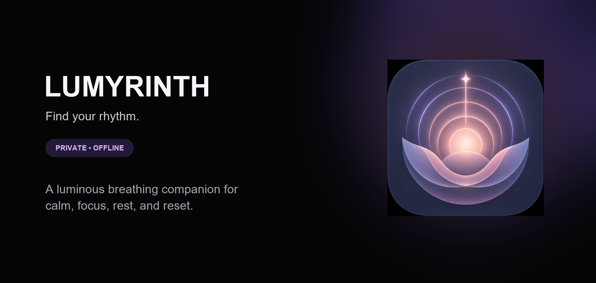

<p align="center">
  
</p>

<p align="center">
  <a href="#features"></a>
  <a href="#privacy"></a>
  <a href="LICENSE"></a>
</p>

<p align="center"><strong>A luminous breathing companion for calm, focus, rest, and reset.</strong></p>

---

## The idea

Lumyrinth turns a quiet moment into a guided rhythm. Choose a practice, follow the living core, and let the breathing cues carry the pace—without accounts, distractions, ads, or cloud sync.

| Private by design | Made for the moment | Beautifully quiet |
| :---: | :---: | :---: |
| Your practice stays on your device. | Start a calming session in seconds. | Atmosphere without overstimulation. |

## Features

| | |
| --- | --- |
| **Guided rhythms** | Slow Down, Equal Rhythm, Square, Steady, Nightfall, and Quick Reset. |
| **Your own pace** | Build custom rhythms inside comfortable V1-safe timing limits. |
| **Living visual guidance** | An animated core expands, holds, and releases in sync with every phase. |
| **Soundscape library** | Rain, Night, Ocean, Forest, Fireplace, Stream, and Deep Space—bundled offline. |
| **Gentle cues** | Optional sound and haptic guidance at phase changes. |
| **Your progress** | Local session history, mindful minutes, and a quiet rhythm tracker. |

## Design language

<p align="center"><code>#050506</code> &nbsp; <code>#A33CFF</code> &nbsp; <code>#5575FF</code> &nbsp; <code>#FF4FC8</code> &nbsp; <code>#F7F5FA</code></p>

Near-black surfaces, soft pastel light, Manrope typography, and the official **Rising Inner Light** mark make Lumyrinth feel calm, premium, and distinctively its own.

## Built with

<p align="center">Kotlin &nbsp;•&nbsp; Jetpack Compose &nbsp;•&nbsp; Room &nbsp;•&nbsp; DataStore &nbsp;•&nbsp; Media3 &nbsp;•&nbsp; WorkManager</p>

| Platform | Minimum | Target |
| --- | ---: | ---: |
| Android | API 26 / Android 8.0 | API 36 / Android 16 |

## Run it locally

```bash
git clone https://github.com/yushy07/lumyrinth.git
cd lumyrinth
```

Use JDK 17 and an Android SDK containing API 36. Open the folder in Android Studio, let Gradle sync, and run the `app` configuration on an emulator or Android device. Debug builds use Android's generated per-user debug keystore; release signing credentials belong only in an untracked `keystore.properties` based on `keystore.properties.example`.

## Privacy

Lumyrinth has no account system, advertising, analytics, cloud sync, or subscription. Preferences, custom rhythms, and session history remain on the device, and Android backup/device transfer is disabled for app data in V1.

The release-ready store listing, Data safety notes, privacy-policy template, and official assets live in [`play-store/`](play-store/).

## Wellness notice

Lumyrinth is for general relaxation and breathing practice. It is not a medical device and does not diagnose or treat any condition. Breathe comfortably and stop if you feel dizzy or uncomfortable.

## License

Copyright © 2026 **Ayush Kant**. Licensed under the [Apache License 2.0](LICENSE).
