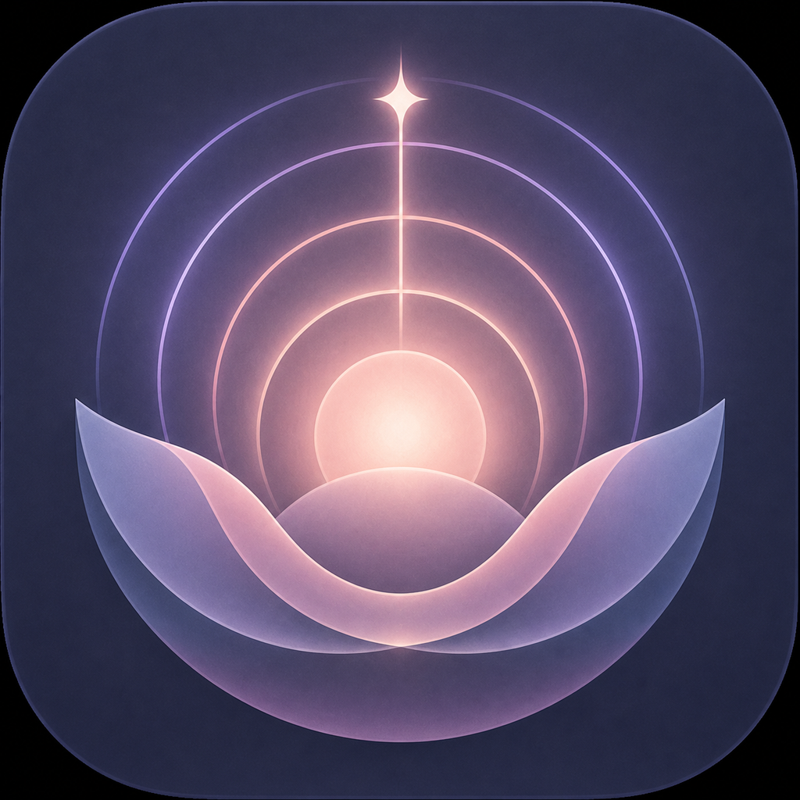
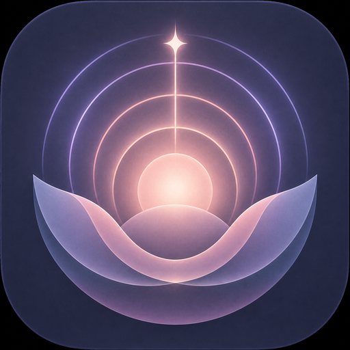

# Lumyrinth

  

<strong>Find your rhythm.</strong>

  A private, offline-first Android breathing companion for calm, focus, rest, and quick resets.

  

## Why Lumyrinth

Lumyrinth is built around one quiet idea: breathing guidance should feel beautiful, private, and easy to begin. There are no accounts, ads, subscriptions, cloud sync, or social feeds—just your rhythm.

## Features

- Six guided breathing exercises for relaxing, focusing, sleeping, and resetting
- Custom rhythms with safe V1 timing boundaries
- Phase-synced breathing visual, haptics, and gentle audio cues
- Seven original offline ambient loops: Rain, Night, Ocean, Forest, Fireplace, Stream, and Deep Space
- Local session history, progress, and rhythm tracking
- Personal settings stored only on the device
- Luminous dark-mode design with the official **Rising Inner Light** identity

## Built with

| Area | Technology |
| --- | --- |
| Language | Kotlin |
| UI | Jetpack Compose + Material 3 |
| Local data | Room + DataStore |
| Audio | AndroidX Media3 + bundled audio |
| Reminders | WorkManager |
| Minimum Android version | Android 8.0 (API 26) |
| Target API | API 37 |

## Run locally

1. Open this folder in Android Studio.
2. Allow Gradle to sync its dependencies.
3. Start the `app` configuration on an Android emulator or device.

## Play Store package

The [`play-store/`](play-store/) folder contains store-listing copy, privacy/Data safety notes, a release checklist, and the official visual assets.

## Wellness note

Lumyrinth is intended for general relaxation and breathing practice. It is not a medical device and does not diagnose or treat any condition. Breathe comfortably and stop if you feel dizzy or uncomfortable.

## License

Copyright © 2026 Ayush Kant. Licensed under the [Apache License 2.0](LICENSE).
